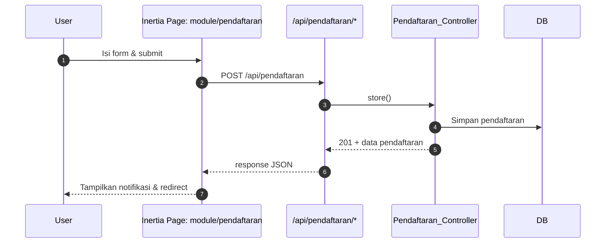
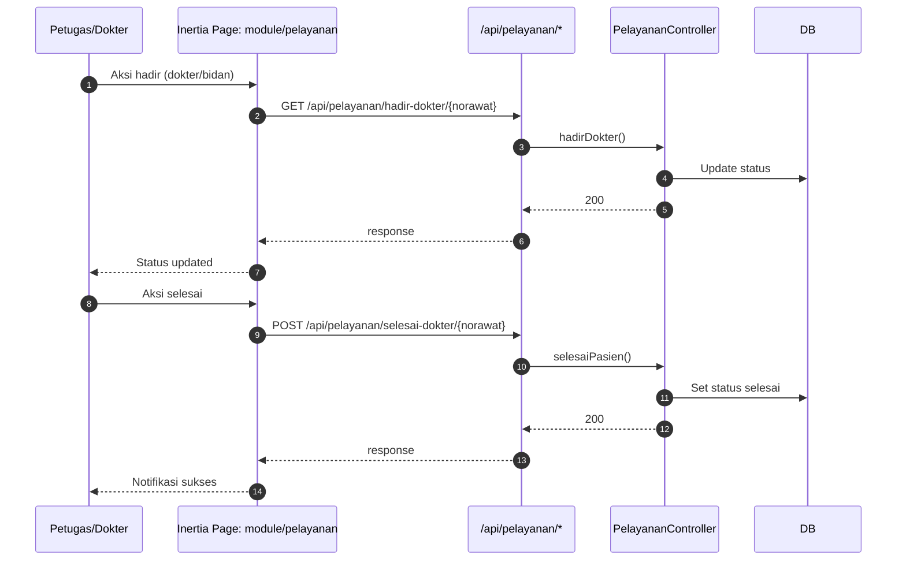
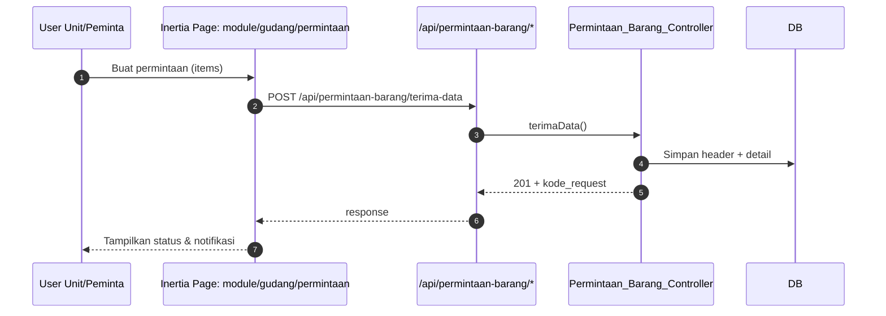
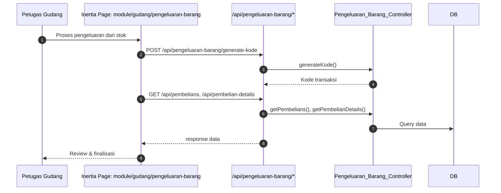

# Blueprint Aplikasi – Apps Dev (Laravel 12 + Inertia React)

Dokumen ini merangkum arsitektur sistem, modul, alur data utama, dan konvensi pengembangan untuk aplikasi ini.

## 1) Ringkasan Teknologi
- Backend: Laravel 12 (PHP 8.2+)
- Frontend: Inertia.js + React 19 + TypeScript
- Bundler: Vite 7 + Tailwind CSS 4
- Data: MariaDB/MySQL
- Cache/Session/Queue: Redis
- Observabilitas: Laravel Pulse, Laravel Telescope (opsional)
- PDF & Ekspor: barryvdh/laravel-dompdf, maatwebsite/excel
- Otorisasi: spatie/laravel-permission
- SSR: Inertia SSR (`resources/js/ssr.tsx`)

Referensi file:
- Konfigurasi Vite: `vite.config.ts`
- Entry React (SPA): `resources/js/app.tsx`
- Entry SSR: `resources/js/ssr.tsx`
- Layout Inertia: `resources/views/app.blade.php`
- Rute API: `routes/api.php`
- Rute Autentikasi: `routes/auth.php`
- Rute Settings (Inertia pages): `routes/settings.php`
- Jadwal (scheduler): `routes/console.php`

## 2) Arsitektur High-Level
```mermaid
flowchart LR
  subgraph Client[Browser]
    A[Inertia React Pages\nresources/js/pages/**.tsx]
  end

  subgraph Laravel[Laravel App]
    B[Routes\nroutes/*.php]
    C[Controllers\napp/Http/Controllers/**]
    D[Policies/Middleware]
    E[Eloquent/Models]
  end

  subgraph Infra[Infra]
    F[(MariaDB/MySQL)]
    G[(Redis\nCache/Session/Queue)]
  end

  subgraph External[Integrasi Eksternal]
    H[BPJS (PCare/MJKN)]
    I[SatuSehat]
  end

  A <-- Inertia --> B --> C --> E --> F
  C --> G
  C <---> H
  C <---> I
  D -. proteksi .- B
```

Catatan:
- CSRF & XSRF ditangani via meta + interceptor (`resources/js/app.tsx`, `resources/views/app.blade.php`).
- Redis digunakan sebagai driver `session`, `cache`, `queue` sesuai `.env`.

## 3) Pemetaan Modul
Direktori halaman modul: `resources/js/pages/module/`
- antrian/
- apotek/
- gudang/
- kasir/
- laporan/
- master/
- monitor/
- pasien/
- pelayanan/
- pembelian/
- pendaftaran/
- pendaftaran-online/
- sdm/

Rute terkait modul umumnya berada di `routes/api.php` dengan prefix per domain (mis. `pendaftaran`, `pelayanan`, `permintaan-barang`, `daftar-permintaan-barang`, `apotek`, `kasir`, dll).

## 4) Alur Data Utama (Sequence)

### 4.1 Pendaftaran Pasien


Endpoint contoh (lihat `routes/api.php`):
- `GET /api/pendaftaran/master-data`
- `POST /api/pendaftaran`
- `POST /api/pendaftaran/hadir`

### 4.2 Pelayanan (Hadir & Selesai)


### 4.3 Gudang – Permintaan Barang


### 4.4 Gudang – Pengeluaran Barang


## 5) Autentikasi & Otorisasi
- Autentikasi via `routes/auth.php` (Laravel auth scaffolding, Sanctum untuk SPA session & CSRF)
- Proteksi halaman Settings via middleware `auth` (`routes/settings.php`)
- Otorisasi per-peran/perizinan menggunakan `spatie/laravel-permission` (konfigurasi role/permission di database)

## 6) Frontend (SPA & SSR)
- SPA bootstrap: `resources/js/app.tsx`
  - Inertia `resolvePageComponent('./pages/${name}.tsx')`
  - Axios interceptor untuk 419 (CSRF timeout) → refresh `/sanctum/csrf-cookie`
- SSR: `resources/js/ssr.tsx`
  - Render server `ReactDOMServer.renderToString`
  - Integrasi `ziggy-js` untuk helper route di sisi server
- Vite alias:
  - `@` → `resources/js`
  - `ziggy-js` → `vendor/tightenco/ziggy`

## 7) Queue & Scheduling
- Queue:
  - Driver: Redis (`QUEUE_CONNECTION=redis`)
  - Dev: `php artisan queue:listen --tries=1`
  - Prod: `php artisan queue:work --daemon` (kelola dengan supervisor)
- Scheduling:
  - Lihat `routes/console.php` (contoh reset harian antrian pada 00:01)
  - Jalankan via `php artisan schedule:work` atau cron tiap menit

## 8) Observabilitas
- Laravel Pulse (metrics) – aktifkan via `.env` (`PULSE_ENABLED=true`)
- Laravel Telescope (debugging/dev tools) – aktifkan di environment dev sesuai dokumentasi resmi

## 9) Ekspor & Dokumen
- PDF: `barryvdh/laravel-dompdf`
- Excel: `maatwebsite/excel`
- Barcode: `picqer/php-barcode-generator`

## 10) Integrasi Eksternal
- BPJS (PCare/MJKN): endpoint tersedia di `routes/api.php` (mis. `/api/get_poli`, `/api/m_jkn/*`)
- SatuSehat: endpoint tersedia (mis. `/api/get_location`, `/api/get_kfa_obat/*`)
- Konfigurasi kunci & base URL melalui `.env` (prefix `BPJS_*`, `SATUSEHAT_*`). Jangan menaruh kredensial produksi di repo.

## 11) Struktur Direktori Singkat
- `app/` – Controller, Event, Export, Request, dll.
- `resources/views/app.blade.php` – Dokumen HTML utama untuk Inertia
- `resources/js/` – Kode React/TypeScript
  - `pages/` – Halaman Inertia (per modul)
  - `components/` – Komponen UI reusable
  - `hooks/` – Hooks kustom (mis. `use-appearance`)
  - `layouts/`, `lib/`, `services/`, `types/`
- `routes/` – `api.php`, `auth.php`, `settings.php`, `console.php`
- `database/migrations/` – Skema database

## 12) Konvensi Koding
- TypeScript + ESLint + Prettier
- Penamaan folder/lintas modul konsisten (`module/<domain>/...`)
- Gunakan Ziggy untuk generate URL named route dari sisi front-end
- Hindari logika berat di komponen; tempatkan di controller/service

## 13) Menambah Modul Baru (Panduan Cepat)
1. Tambah halaman Inertia di `resources/js/pages/module/<nama-modul>/index.tsx` (atau struktur yang diperlukan)
2. Tambah route API di `routes/api.php` (prefix sesuai domain)
3. Buat controller Laravel di `app/Http/Controllers/Module/<Domain>/*Controller.php`
4. Hubungkan halaman dengan endpoint via Axios/route Ziggy
5. Tambah permission/role bila diperlukan (spatie permission)
6. Tambah migrasi & model jika ada data baru

## 14) API Surface (Ringkasan Kelompok)
Beberapa grup rute penting (lihat `routes/api.php` untuk lengkapnya):
- `master/*` – Data master (pasien, poli, penjamin, dokter)
- `pendaftaran/*` – Buat & update pendaftaran
- `pelayanan/*` – Hadir/selesai/batal pelayanan; SOAP dokter/bidan
- `pelayanan/permintaan/*` – Cetak & store permintaan (layanan)
- `permintaan-barang/*` – Ambil/konfirmasi permintaan barang gudang
- `daftar-permintaan-barang/*` – Proses, konfirmasi, harga dasar
- `pengeluaran-barang/*` – Kode, pembelian & detail
- `apotek/*` – Kode faktur/obat & harga bebas
- `kasir/*` – PDF dan preview data
- `websocket/*` – Endpoint monitoring real-time (HTTP)
- `web-settings/*` – Pengaturan web & integrasi

## 15) Deployment (Garis Besar)
- Build assets: `npm run build` (tambahkan `npm run build:ssr` jika pakai SSR)
- Cache konfigurasi/route/view: `php artisan config:cache && php artisan route:cache && php artisan view:cache`
- Pastikan queue worker & scheduler berjalan
- Web server diarahkan ke `public/`
- Set `.env` produksi (DB/Redis/Integrasi) dan kunci aplikasi (`APP_KEY`)

## 16) Dokumen Terkait
- Antrian/Queue: `QUEUE_MANAGEMENT_README.md`
- Keamanan: `SECURITY.md`
- Lisensi: `LICENSE-PROPRIETARY.md` (Aplikasi bersifat proprietary milik PT Dolphin; lihat juga pemberitahuan di bagian atas `LICENSE`)

---

Jika Anda membutuhkan diagram tambahan (ERD, deployment diagram), atau ingin menyorot modul tertentu (mis. `gudang/permintaan` atau `pelayanan`), beri tahu kami agar blueprint diperluas sesuai kebutuhan.
