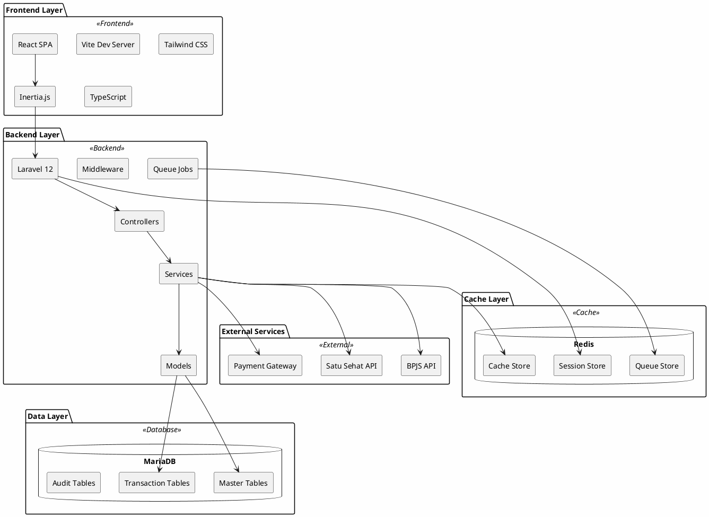
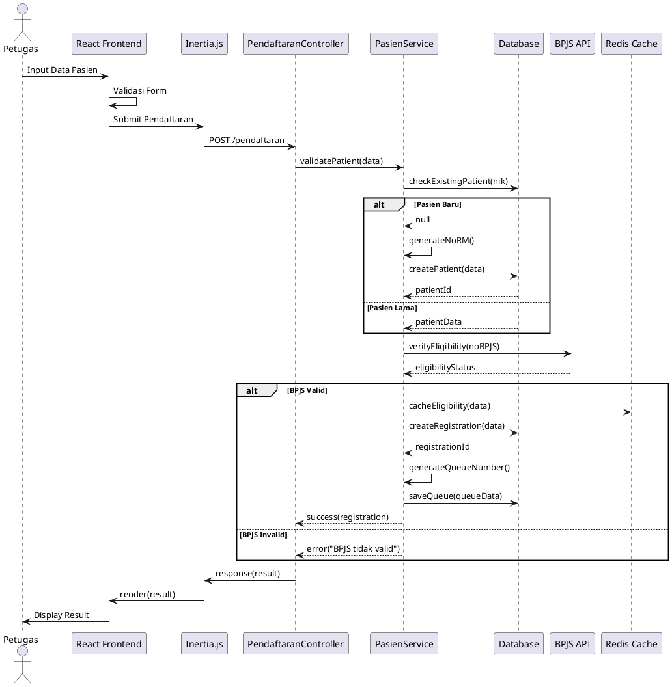
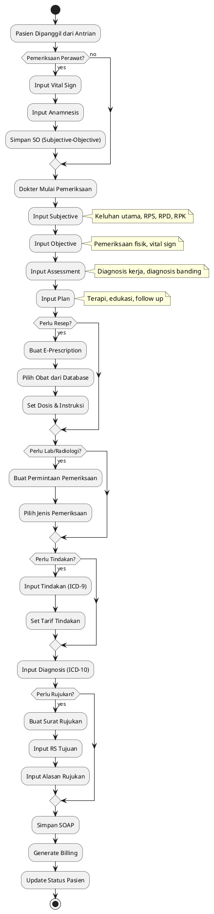
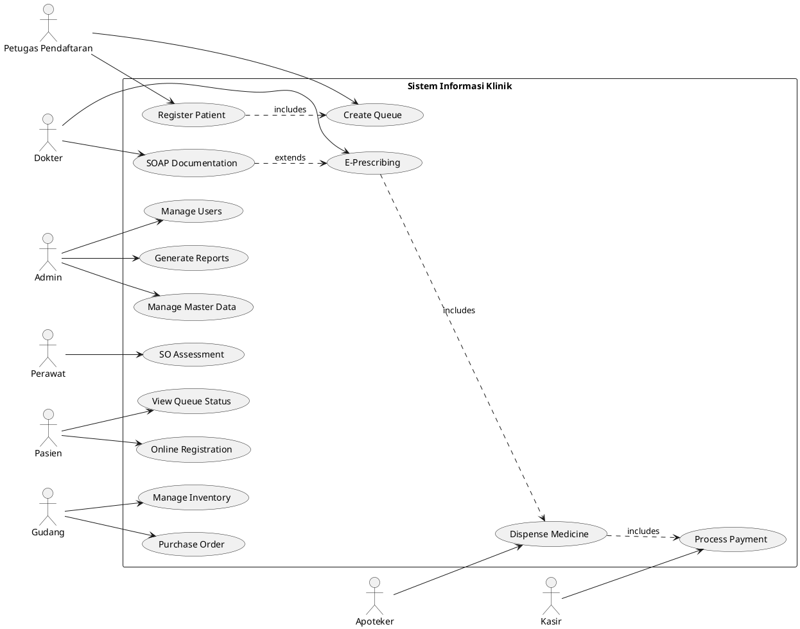
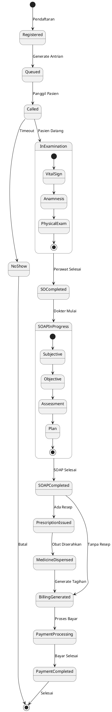
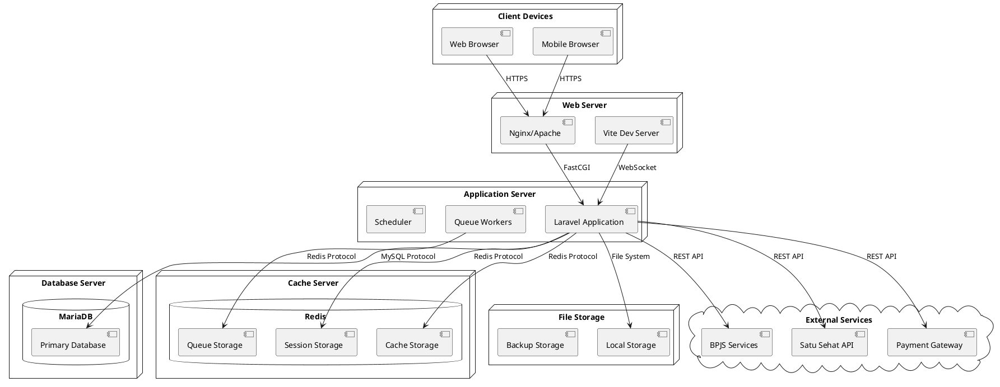
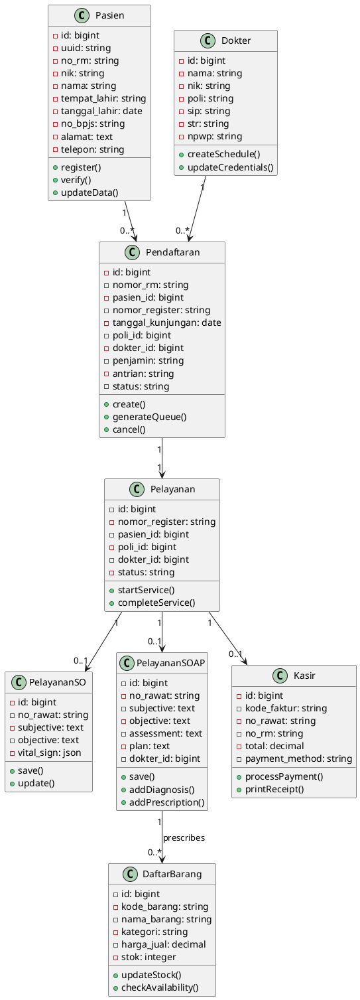

# Diagram Aplikasi dalam Format PlantUML

## 1. Component Diagram - Arsitektur Sistem

## 2. Sequence Diagram - Proses Pendaftaran Pasien BPJS

## 3. Activity Diagram - Alur Pelayanan SOAP

## 4. Use Case Diagram - Sistem Informasi Klinik

## 5. State Diagram - Status Pasien

## 6. Deployment Diagram

## 7. Class Diagram - Core Models

## Cara Menggunakan Diagram PlantUML

### Online Tools:
1. **PlantUML Online Server**: http://www.plantuml.com/plantuml/uml/
2. **PlantText**: https://www.planttext.com/
3. **Draw.io**: https://app.diagrams.net/ (support PlantUML)

### VS Code Extensions:
1. Install "PlantUML" extension
2. Install Java (required for local rendering)
3. Use `Alt+D` to preview diagram

### Export Options:
- PNG
- SVG
- PDF
- LaTeX

### Integration:
- Dapat di-embed di dokumentasi Markdown
- Support di GitLab/GitHub dengan PlantUML renderer
- Dapat di-integrate dengan CI/CD untuk auto-generate diagram

---

*Semua diagram di atas dapat di-render menggunakan PlantUML processor. Copy kode di antara \`\`\`plantuml dan \`\`\` ke PlantUML renderer untuk visualisasi.*
