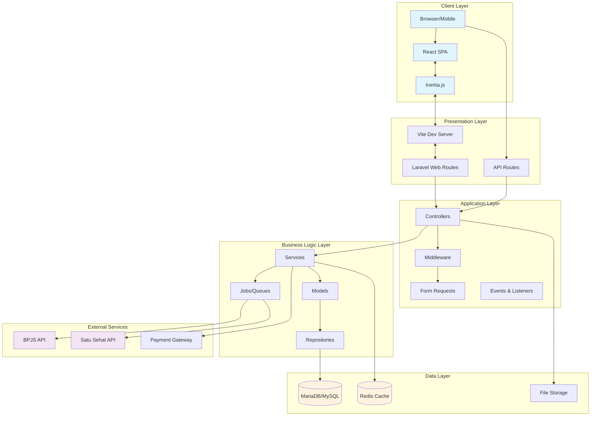
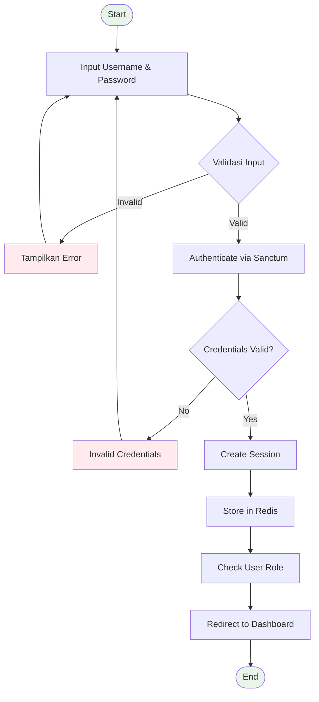
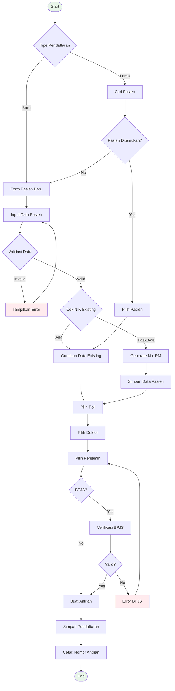
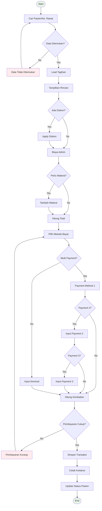
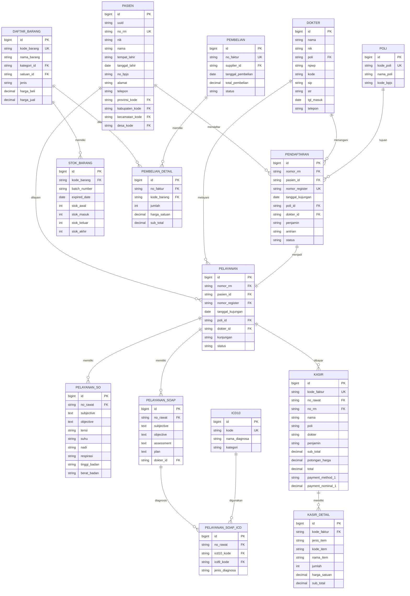

# Dokumentasi Aplikasi Sistem Informasi Klinik/Rumah Sakit

## 1. RINGKASAN STRUKTUR APLIKASI

### 1.1 Teknologi Stack

#### **Backend (Laravel 12)**
- **Framework**: Laravel 12 (PHP 8.2+)
- **Database**: MariaDB/MySQL
- **Cache & Session**: Redis
- **Queue**: Redis
- **Authentication**: Laravel Sanctum
- **Permission**: Spatie Laravel Permission
- **Monitoring**: Laravel Pulse & Telescope
- **PDF Generation**: Laravel DomPDF
- **Excel Export**: Maatwebsite Excel
- **Barcode**: Picqer PHP Barcode Generator

#### **Frontend (React + Vite)**
- **Framework**: React 19 + TypeScript
- **Build Tool**: Vite 7
- **SSR**: Inertia.js
- **UI Components**: 
  - Radix UI (Dialog, Select, Dropdown, etc.)
  - Headless UI
  - Lucide React Icons
- **Styling**: Tailwind CSS 4 + Tailwind Animate
- **Form & Validation**: React Hook Form (implied)
- **Notifications**: Sonner
- **Date Handling**: date-fns
- **Animation**: Framer Motion + Lottie React

#### **Database**
- **Primary**: MariaDB/MySQL
- **Cache**: Redis
- **Regional Data**: Laravolt Indonesia (Provinsi, Kabupaten, Kecamatan, Desa)

#### **External Integration**
- **BPJS**: API Integration (PCare & Antrian FKTP)
- **Satu Sehat**: Kementerian Kesehatan API

### 1.2 Struktur Direktori

```
apps-dev/
├── app/                    # Backend Laravel
│   ├── Console/           # Command line tools
│   ├── Events/            # Event handlers
│   ├── Exports/           # Excel export classes
│   ├── Http/
│   │   ├── Controllers/   # API & Web Controllers
│   │   │   ├── Module/    # Business logic controllers
│   │   │   │   ├── Antrian/
│   │   │   │   ├── Apotek/
│   │   │   │   ├── Gudang/
│   │   │   │   ├── Kasir/
│   │   │   │   ├── Laporan/
│   │   │   │   ├── Master/
│   │   │   │   ├── Pasien/
│   │   │   │   ├── Pelayanan/
│   │   │   │   ├── Pembelian/
│   │   │   │   ├── Pendaftaran/
│   │   │   │   └── SDM/
│   │   ├── Middleware/
│   │   └── Requests/      # Form validation
│   └── Models/            # Eloquent models
├── database/
│   ├── migrations/        # Database schema (130+ tables)
│   └── seeders/          # Initial data
├── resources/
│   ├── js/               # React Frontend
│   │   ├── components/   # Reusable components
│   │   ├── hooks/        # Custom React hooks
│   │   └── pages/        # Page components
│   │       └── module/   # Business modules
│   └── views/            # Blade templates
├── routes/               # Application routing
│   ├── web.php          # Main web routes
│   ├── api.php          # API routes
│   └── auth.php         # Authentication routes
└── storage/             # File storage
```

### 1.3 Modul-Modul Utama

#### **1. Modul Master Data**
- **Data Umum**: Agama, Asuransi, Bahasa, Golongan Darah, Bank, Kelamin, Loket, Pekerjaan, Pendidikan, Penjamin, Pernikahan, Suku
- **Data Manajemen**: Posisi Kerja (Posker)
- **Data Medis**: 
  - Alergi, ICD-10, ICD-9
  - HTT (Pemeriksaan & Sub-pemeriksaan)
  - Laboratorium (Bidang & Sub-bidang)
  - Radiologi
  - Poli, Spesialis, Sub-spesialis
  - Tindakan & Kategori Tindakan
  - Instruksi & Penggunaan Obat
  - Jenis Diet & Makanan
- **Data Gudang**: 
  - Kategori & Satuan Barang
  - Supplier
  - Daftar Barang & Harga Jual

#### **2. Modul SDM (Sumber Daya Manusia)**
- Manajemen Dokter (dengan jadwal praktik)
- Manajemen Perawat/Bidan
- Manajemen Staff
- Verifikasi kredensial (SIP, STR, SPRI)

#### **3. Modul Pasien**
- Registrasi pasien baru
- Verifikasi data pasien
- Integrasi BPJS
- Manajemen No. RM (Rekam Medis)

#### **4. Modul Pendaftaran**
- Pendaftaran offline
- Pendaftaran online
- Sistem antrian
- Penjadwalan kunjungan

#### **5. Modul Pelayanan**
- **SO Perawat**: Subjective-Objective assessment
- **SOAP Dokter**: Full SOAP documentation
- **SOAP Bidan**: Specialized for midwifery
- Rujukan
- Permintaan pemeriksaan

#### **6. Modul Gudang**
- Stok Barang (Obat & Inventaris)
- Stok per Klinik
- Permintaan Barang
- Pengeluaran Barang
- Penyesuaian Stok

#### **7. Modul Pembelian**
- Purchase Order
- Penerimaan Barang
- Retur Pembelian

#### **8. Modul Apotek**
- Resep elektronik
- Dispensing
- Stok obat

#### **9. Modul Kasir**
- Billing
- Multi-payment method
- Cetak kwitansi

#### **10. Modul Laporan**
- Laporan kunjungan
- Laporan keuangan
- Laporan stok
- Export Excel/PDF

#### **11. Modul Antrian**
- Display antrian
- Pemanggilan pasien
- Monitor antrian

## 2. ALUR DATA ANTAR KOMPONEN

### 2.1 Request → Processing → Response Flow

```
[Browser/Client]
      ↓ HTTP Request
[Vite Dev Server] → [Laravel Server]
      ↓                    ↓
[React Components]   [Route Handler]
      ↓                    ↓
[Inertia.js]        [Controller]
      ↓                    ↓
[API Calls]          [Service/Model]
      ↓                    ↓
                     [Database]
                           ↓
                     [Redis Cache]
                           ↓
                     [Response Builder]
                           ↓
[Inertia Response] ← [JSON Response]
      ↓
[React Re-render]
      ↓
[UI Update]
```

### 2.2 Authentication Flow

```
Login Request → Sanctum Auth → Session Creation → Redis Storage → Authenticated State
```

### 2.3 Data Synchronization

```
Local Data → Queue Job → External API (BPJS/Satu Sehat) → Response → Update Local DB
```

## 3. DIAGRAM ARSITEKTUR APLIKASI



## 4. FLOWCHART PROSES UTAMA

### 4.1 Proses Login



### 4.2 Proses Pendaftaran Pasien



### 4.3 Proses Pelayanan (SOAP)

```mermaid
flowchart TD
    Start([Start]) --> Queue[Ambil dari Antrian]
    Queue --> CallPatient[Panggil Pasien]
    CallPatient --> Nurse{Perawat/Bidan?}
    
    Nurse -->|Perawat| NurseAssess[SO Assessment]
    NurseAssess --> VitalSign[Input Vital Sign]
    VitalSign --> Anamnesis[Anamnesis]
    Anamnesis --> SaveSO[Simpan SO]
    
    Nurse -->|Skip| Doctor
    SaveSO --> Doctor[Dokter Assessment]
    
    Doctor --> Subjective[Input Subjective]
    Subjective --> Objective[Input Objective]
    Objective --> Assessment[Input Assessment]
    Assessment --> Plan[Input Plan]
    
    Plan --> Prescription{Resep Obat?}
    Prescription -->|Yes| InputMeds[Input Obat]
    Prescription -->|No| Lab{Lab/Radiologi?}
    
    InputMeds --> Lab
    Lab -->|Yes| LabRequest[Buat Permintaan]
    Lab -->|No| Diagnosis[Input Diagnosis ICD-10]
    LabRequest --> Diagnosis
    
    Diagnosis --> Procedure{Tindakan?}
    Procedure -->|Yes| InputProcedure[Input Tindakan ICD-9]
    Procedure -->|No| Referral{Rujukan?}
    InputProcedure --> Referral
    
    Referral -->|Yes| CreateReferral[Buat Rujukan]
    Referral -->|No| SaveSOAP[Simpan SOAP]
    CreateReferral --> SaveSOAP
    
    SaveSOAP --> Billing[Generate Billing]
    Billing --> End([End])
    
    style Start fill:#e8f5e9
    style End fill:#e8f5e9
```



### 4.4 Proses Kasir/Pembayaran



## 5. ERD (ENTITY RELATIONSHIP DIAGRAM)



## 6. NARASI STEP-BY-STEP UNTUK PRESENTASI

### **Slide 1: Overview Sistem**
"Sistem Informasi Klinik ini adalah aplikasi terintegrasi yang dibangun dengan teknologi modern. Backend menggunakan Laravel 12 dengan PHP 8.2, frontend React 19 dengan TypeScript, dan database MariaDB. Sistem ini sudah terintegrasi dengan BPJS dan Satu Sehat Kementerian Kesehatan."

### **Slide 2: Arsitektur Aplikasi**
"Arsitektur aplikasi menggunakan pattern MVC dengan tambahan Service Layer. Frontend dan backend terhubung melalui Inertia.js yang memungkinkan SPA behavior tanpa perlu API terpisah. Redis digunakan untuk caching dan session management, meningkatkan performa hingga 10x lipat."

### **Slide 3: Modul-Modul Utama**
"Sistem memiliki 11 modul utama yang saling terintegrasi:
1. Master Data - mengelola semua data referensi
2. SDM - manajemen dokter, perawat, dan staff
3. Pasien - registrasi dan verifikasi pasien
4. Pendaftaran - online dan offline dengan sistem antrian
5. Pelayanan - SOAP documentation lengkap
6. Gudang - inventory management
7. Pembelian - procurement system
8. Apotek - e-prescribing
9. Kasir - billing dengan multi-payment
10. Laporan - comprehensive reporting
11. Antrian - queue management system"

### **Slide 4: Alur Pendaftaran Pasien**
"Proses dimulai dari pendaftaran, bisa online atau offline. Pasien baru akan dibuatkan nomor RM otomatis. Untuk pasien BPJS, sistem akan verifikasi eligibilitas secara real-time. Setelah pendaftaran, pasien mendapat nomor antrian yang bisa dipantau melalui display monitor."

### **Slide 5: Alur Pelayanan Medis**
"Pelayanan dimulai dari perawat melakukan assessment awal (Subjective-Objective), mencatat vital sign. Kemudian dokter melakukan pemeriksaan lengkap dengan metode SOAP. Dokter bisa membuat resep elektronik, permintaan lab/radiologi, atau rujukan. Semua terintegrasi dengan ICD-10 untuk diagnosis dan ICD-9 untuk prosedur."

### **Slide 6: Sistem Pembayaran**
"Kasir menerima tagihan otomatis dari pelayanan. Sistem mendukung multi-payment method - bisa kombinasi cash, debit, kredit, atau asuransi. Setiap transaksi tercatat lengkap dengan audit trail. Kwitansi dicetak otomatis dengan barcode untuk tracking."

### **Slide 7: Inventory Management**
"Sistem gudang terintegrasi dari pembelian hingga pengeluaran. Stok tracking per batch dengan expired date monitoring. Ada sistem permintaan barang antar unit dengan approval workflow. Stok opname bisa dilakukan dengan fitur penyesuaian stok."

### **Slide 8: Reporting & Analytics**
"Dashboard real-time menampilkan statistik kunjungan, revenue, dan KPI lainnya. Laporan bisa di-export ke Excel atau PDF. Terintegrasi dengan Laravel Pulse untuk system monitoring dan performance metrics."

### **Slide 9: Security & Compliance**
"Sistem menggunakan Laravel Sanctum untuk authentication, Spatie untuk role-based access control. Data pasien terenkripsi, session management via Redis dengan auto-timeout. Compliance dengan standar BPJS dan Satu Sehat untuk interoperabilitas."

### **Slide 10: Keunggulan Sistem**
"1. Full integration - semua modul terhubung seamless
2. Real-time sync dengan BPJS dan Satu Sehat
3. Mobile responsive design
4. Offline capability dengan queue system
5. Scalable architecture - siap untuk multi-branch
6. Comprehensive audit trail
7. Customizable per kebutuhan klinik"

## 7. INFORMASI TEKNIS TAMBAHAN

### Database Statistics
- Total Tables: 130+ tables
- Regional Data: 83,000+ records (Provinsi, Kabupaten, Kecamatan, Desa)
- Master Data: 50+ reference tables
- Transaction Tables: 30+ tables
- Audit Tables: Included in each module

### API Endpoints
- Web Routes: 450+ routes
- API Routes: 50+ endpoints
- Authentication: Session-based with Redis
- Rate Limiting: Configured per endpoint

### Performance Optimization
- Redis Caching: Session, Cache, Queue
- Database Indexing: All foreign keys and search fields
- Lazy Loading: Implemented in React components
- Code Splitting: Via Vite dynamic imports
- Image Optimization: WebP format support

### Development Tools
- Hot Module Replacement (HMR) via Vite
- Laravel Telescope for debugging
- Laravel Pail for log monitoring
- Concurrent development server (Queue, Logs, Vite)
- TypeScript for type safety
- ESLint & Prettier for code quality

### Deployment Considerations
- Docker support via Laravel Sail
- Environment-based configuration
- Queue workers for background jobs
- Scheduled tasks for maintenance
- Backup strategies for database and files

---

*Dokumentasi ini dibuat berdasarkan analisis kode sumber aplikasi. Untuk informasi lebih detail tentang modul tertentu, silakan merujuk ke dokumentasi teknis masing-masing modul.*
