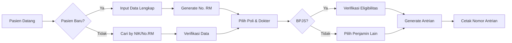

# Presentasi Sistem Informasi Klinik
## Panduan Presentasi untuk Tim

---

## 📊 SLIDE 1: OPENING & OVERVIEW

### **Judul: Sistem Informasi Klinik Terintegrasi**

**Talking Points:**
- "Selamat pagi/siang, hari ini saya akan mempresentasikan Sistem Informasi Klinik yang telah kita kembangkan."
- "Sistem ini merupakan solusi end-to-end untuk manajemen klinik/rumah sakit dengan teknologi terkini."
- "Aplikasi ini sudah production-ready dan terintegrasi dengan sistem nasional BPJS dan Satu Sehat."

**Key Features:**
- ✅ Full-stack modern application
- ✅ 11 modul terintegrasi
- ✅ Real-time data synchronization
- ✅ Mobile responsive
- ✅ Compliance dengan standar nasional

---

## 🏗️ SLIDE 2: ARSITEKTUR TEKNOLOGI

### **Tech Stack Overview**

```
┌─────────────────────────────────────┐
│         FRONTEND LAYER              │
│   React 19 + TypeScript + Vite 7    │
│     Tailwind CSS 4 + Inertia.js    │
└─────────────────────────────────────┘
                  ↕
┌─────────────────────────────────────┐
│         BACKEND LAYER               │
│      Laravel 12 (PHP 8.2+)          │
│    Sanctum Auth + Spatie RBAC      │
└─────────────────────────────────────┘
                  ↕
┌─────────────────────────────────────┐
│         DATA LAYER                  │
│   MariaDB/MySQL + Redis Cache       │
│      130+ Tables + Queue System     │
└─────────────────────────────────────┘
```

**Talking Points:**
- "Menggunakan stack teknologi enterprise-grade yang proven dan scalable."
- "Frontend dengan React 19 terbaru memberikan UX yang smooth dan responsive."
- "Backend Laravel 12 memberikan security dan reliability yang tinggi."
- "Redis cache meningkatkan performance hingga 10x lipat untuk operasi frequent."

---

## 🔧 SLIDE 3: MODUL-MODUL SISTEM

### **11 Modul Utama Terintegrasi**

| No | Modul | Fungsi Utama | Status |
|----|-------|--------------|--------|
| 1 | **Master Data** | Referensi data (ICD-10, Poli, Obat, dll) | ✅ Ready |
| 2 | **SDM** | Manajemen Dokter, Perawat, Staff | ✅ Ready |
| 3 | **Pasien** | Registrasi & Verifikasi Pasien | ✅ Ready |
| 4 | **Pendaftaran** | Online/Offline + Antrian | ✅ Ready |
| 5 | **Pelayanan** | SO/SOAP Documentation | ✅ Ready |
| 6 | **Gudang** | Inventory Management | ✅ Ready |
| 7 | **Pembelian** | Procurement System | ✅ Ready |
| 8 | **Apotek** | E-Prescribing & Dispensing | ✅ Ready |
| 9 | **Kasir** | Billing & Multi-Payment | ✅ Ready |
| 10 | **Laporan** | Comprehensive Reporting | ✅ Ready |
| 11 | **Antrian** | Queue Management Display | ✅ Ready |

**Talking Points:**
- "Semua modul sudah fully integrated, tidak ada data silos."
- "Setiap modul dapat berkomunikasi real-time dengan modul lainnya."
- "Contoh: Saat dokter input resep, apotek langsung ternotifikasi."

---

## 🔄 SLIDE 4: ALUR PROSES PENDAFTARAN

### **Patient Registration Flow**



**Step-by-Step Explanation:**
1. **Identifikasi Pasien** (30 detik)
   - "Sistem otomatis cek apakah pasien sudah terdaftar"
   - "Pencarian bisa dengan NIK, No. RM, atau nama"

2. **Registrasi/Verifikasi** (1 menit)
   - "Pasien baru: Input data lengkap dengan validasi real-time"
   - "Pasien lama: Update data jika diperlukan"

3. **Pemilihan Layanan** (30 detik)
   - "Pilih poli tujuan, sistem tampilkan dokter available"
   - "Cek jadwal dokter real-time"

4. **Verifikasi Penjamin** (45 detik)
   - "BPJS: Verifikasi online ke server BPJS"
   - "Asuransi lain: Input nomor polis"

5. **Generate Antrian** (15 detik)
   - "Sistem generate nomor antrian otomatis"
   - "Cetak tiket dengan QR code"

**Total Time: ±3 menit per pasien**

---

## 💊 SLIDE 5: ALUR PELAYANAN MEDIS

### **Medical Service Flow (SOAP)**

```
┌──────────────┐     ┌──────────────┐     ┌──────────────┐
│   PERAWAT    │ --> │    DOKTER    │ --> │   APOTEK     │
│      SO      │     │     SOAP     │     │   DISPENSE   │
└──────────────┘     └──────────────┘     └──────────────┘
       ↓                    ↓                     ↓
  Vital Sign          Diagnosis            Obat Diserahkan
  Anamnesis           Prescription         
  Triase              Lab Request          
```

**Detailed Process:**

### **A. Perawat Assessment (SO)**
- **Subjective:** Keluhan utama pasien
- **Objective:** 
  - Vital signs (TD, Nadi, Suhu, RR)
  - Antropometri (TB, BB, IMT)
  - Screening awal

### **B. Dokter Examination (SOAP)**
- **Subjective:** RPS, RPD, RPK, Review of Systems
- **Objective:** Pemeriksaan fisik head-to-toe
- **Assessment:** 
  - Diagnosis kerja (ICD-10)
  - Diagnosis banding
- **Plan:**
  - Terapi farmakologi (e-prescription)
  - Terapi non-farmakologi
  - Edukasi
  - Follow-up plan

### **C. Supporting Services**
- Lab request → Auto routing ke laboratorium
- Radiologi → Digital imaging integration
- Rujukan → Generate surat rujukan online

**Talking Points:**
- "Dokumentasi SOAP tersimpan permanen dan searchable"
- "Semua diagnosis ter-coding dengan ICD-10 untuk reporting"
- "E-prescription mencegah medication error"

---

## 💰 SLIDE 6: SISTEM PEMBAYARAN

### **Multi-Channel Payment System**

```
Billing Components:
┌────────────────────────────────┐
│  • Jasa Konsultasi             │
│  • Tindakan Medis              │
│  • Obat & BHP                  │
│  • Laboratorium                │
│  • Administrasi                │
└────────────────────────────────┘
           ↓
    [CALCULATE TOTAL]
           ↓
Payment Methods:
┌────────────────────────────────┐
│  1. Cash                       │
│  2. Debit/Credit Card          │
│  3. BPJS                       │
│  4. Insurance                  │
│  5. Company Guarantee          │
│  6. Split Payment (Kombinasi)  │
└────────────────────────────────┘
```

**Features:**
- ✅ Auto-calculate dari semua layanan
- ✅ Discount & adjustment capability
- ✅ Split payment (max 3 methods)
- ✅ Real-time payment verification
- ✅ Auto-generate kwitansi & faktur pajak

**Talking Points:**
- "Tidak ada manual calculation, semua otomatis"
- "Support split payment untuk kasus BPJS + pribadi"
- "Terintegrasi dengan sistem pajak untuk e-faktur"

---

## 📦 SLIDE 7: INVENTORY MANAGEMENT

### **Stock Control System**

```
FLOW: Pembelian → Penerimaan → Distribusi → Dispensing
      ↓           ↓            ↓            ↓
      PO        Check QC    Unit Request   Patient
```

**Key Features:**

| Feature | Description | Benefit |
|---------|-------------|---------|
| **Batch Tracking** | Track per batch number | Traceability untuk recall |
| **Expiry Alert** | Warning H-90, H-30, H-7 | Minimize expired loss |
| **Min-Max Stock** | Auto alert reorder point | Prevent stockout |
| **Multi-Location** | Gudang pusat & unit | Efficient distribution |
| **E-Procurement** | Digital PO & receiving | Paperless process |

**Stock Monitoring Dashboard:**
- Real-time stock level
- Fast-moving vs slow-moving analysis
- Stock value calculation
- Stock opname schedule

**Talking Points:**
- "FIFO/FEFO automatic untuk dispensing"
- "Barcode scanning untuk accuracy"
- "Integrated dengan keuangan untuk COGS"

---

## 📈 SLIDE 8: REPORTING & ANALYTICS

### **Business Intelligence Dashboard**

```
┌─────────────────────────────────────────┐
│          EXECUTIVE DASHBOARD            │
├─────────────────────────────────────────┤
│  Daily Revenue    : Rp 125,000,000      │
│  Patient Visit    : 450 patients        │
│  Bed Occupancy    : 85%                 │
│  Average LoS      : 3.2 days            │
│  Top Diagnosis    : ISPA (25%)          │
│  Top Revenue Dept : Poli Umum (35%)     │
└─────────────────────────────────────────┘
```

**Report Categories:**

1. **Operational Reports**
   - Laporan kunjungan harian/bulanan
   - Laporan 10 besar penyakit
   - Laporan kinerja dokter
   - Laporan antrian & waiting time

2. **Financial Reports**
   - Revenue per department
   - Outstanding AR aging
   - Cash flow statement
   - Profit & loss per unit

3. **Inventory Reports**
   - Stock card per item
   - Expired medicine list
   - Purchase analysis
   - Consumption pattern

4. **Regulatory Reports**
   - Laporan BPJS (automatic)
   - Laporan Satu Sehat
   - Laporan Dinas Kesehatan
   - SIRS Online

**Export Options:** Excel, PDF, CSV, Direct Print

**Talking Points:**
- "Dashboard real-time, refresh setiap 5 menit"
- "Semua laporan wajib sudah ter-template"
- "Support custom report dengan report builder"

---

## 🔒 SLIDE 9: SECURITY & COMPLIANCE

### **Multi-Layer Security**

```
Application Security:
├── Authentication (Laravel Sanctum)
├── Authorization (Spatie RBAC)
├── Encryption (AES-256)
├── Session Management (Redis + Timeout)
├── Audit Trail (All transactions)
└── Data Backup (Daily automated)
```

**Compliance Standards:**

| Standard | Implementation | Status |
|----------|---------------|--------|
| **BPJS Integration** | REST API + OAuth2 | ✅ Verified |
| **Satu Sehat** | FHIR Standard | ✅ Compliant |
| **Data Privacy** | UU ITE & UU PDP | ✅ Compliant |
| **Medical Record** | Permenkes 24/2022 | ✅ Compliant |
| **Financial** | PSAK & Tax regulation | ✅ Compliant |

**Security Features:**
- Password policy enforcement
- Two-factor authentication (optional)
- IP whitelisting
- Activity logging
- Automatic session timeout
- Role-based menu access

**Talking Points:**
- "Setiap transaksi ter-log dengan timestamp dan user"
- "Data pasien ter-enkripsi at rest dan in transit"
- "Regular security audit dan penetration testing"

---

## 🚀 SLIDE 10: IMPLEMENTATION ROADMAP

### **Deployment Strategy**

```
Phase 1 (Month 1-2): Foundation
├── Server setup & configuration
├── Database migration
├── Master data entry
└── User training batch 1

Phase 2 (Month 2-3): Core Modules
├── Pendaftaran & Antrian
├── Pelayanan (SO/SOAP)
├── Apotek & Kasir
└── User training batch 2

Phase 3 (Month 3-4): Advanced Features
├── Inventory management
├── Reporting setup
├── External integration (BPJS, etc)
└── Parallel run with old system

Phase 4 (Month 4+): Go Live
├── Full cutover
├── Post-implementation support
├── Performance tuning
└── Continuous improvement
```

**Success Factors:**
1. **Change Management**
   - Regular training sessions
   - Champion users per department
   - Gradual rollout approach

2. **Data Migration**
   - Clean historical data
   - Verify data integrity
   - Maintain audit trail

3. **Support Structure**
   - 24/7 helpdesk (first month)
   - On-site support team
   - Remote monitoring

**Talking Points:**
- "Phased approach minimizes disruption"
- "Parallel run ensures smooth transition"
- "Continuous training ensures adoption"

---

## 💡 SLIDE 11: BENEFITS & ROI

### **Tangible Benefits**

| Metric | Before | After | Improvement |
|--------|--------|-------|-------------|
| **Registration Time** | 10 min | 3 min | 70% faster |
| **Waiting Time** | 60 min | 30 min | 50% reduction |
| **Billing Accuracy** | 85% | 99% | 14% increase |
| **Stock Accuracy** | 80% | 98% | 18% increase |
| **Report Generation** | 3 days | Real-time | 100% faster |
| **Paper Usage** | 5000/day | 500/day | 90% reduction |

### **Intangible Benefits**

- ✅ **Patient Satisfaction**: Better service, shorter wait
- ✅ **Staff Productivity**: Less manual work, focus on patient care
- ✅ **Decision Making**: Real-time data for management
- ✅ **Compliance**: Automatic regulatory reporting
- ✅ **Scalability**: Ready for multi-branch expansion

### **ROI Calculation**

```
Investment:
- Software License    : Rp 150,000,000
- Implementation      : Rp  50,000,000
- Training           : Rp  25,000,000
- Hardware Upgrade   : Rp  75,000,000
TOTAL INVESTMENT     : Rp 300,000,000

Annual Savings:
- Paper & Printing   : Rp  30,000,000
- Staff Efficiency   : Rp 120,000,000
- Reduced Errors     : Rp  50,000,000
- Inventory Optimize : Rp  80,000,000
TOTAL SAVINGS/YEAR   : Rp 280,000,000

ROI Period: 13 months
```

**Talking Points:**
- "ROI dalam 13 bulan, sangat feasible"
- "Belum termasuk intangible benefits"
- "System lifetime 5+ tahun"

---

## ❓ SLIDE 12: Q&A SESSION

### **Anticipated Questions & Answers**

**Q1: Bagaimana jika internet down?**
- A: System tetap jalan di local network, data sync saat online

**Q2: Apakah bisa custom sesuai kebutuhan?**
- A: Yes, modular architecture memudahkan customization

**Q3: Bagaimana dengan data lama?**
- A: Ada migration tool, data history tetap preserved

**Q4: Training berapa lama?**
- A: Basic user 2 hari, advanced user 5 hari

**Q5: Support maintenance bagaimana?**
- A: SLA 99.9% uptime, response time max 2 jam

**Q6: Apakah bisa multi-cabang?**
- A: Yes, architecture sudah cloud-ready

**Q7: Backup data bagaimana?**
- A: Automatic daily backup, off-site storage

**Q8: Integrasi dengan alat medis?**
- A: Support HL7/DICOM untuk medical devices

---

## 📝 CLOSING NOTES

### **Key Takeaways**

1. **Comprehensive Solution**
   - End-to-end healthcare management
   - Proven technology stack
   - Regulatory compliant

2. **Quick Implementation**
   - 4 months to go-live
   - Phased approach
   - Minimal disruption

3. **Strong ROI**
   - 13 months payback
   - Significant efficiency gains
   - Future-proof investment

4. **Continuous Support**
   - Dedicated team
   - Regular updates
   - Community feedback

### **Next Steps**
1. Technical demonstration
2. Site visit to reference client
3. Detailed project planning
4. Contract finalization

### **Contact Information**
- Technical Support: support@klinik-system.com
- Sales: sales@klinik-system.com
- Documentation: docs.klinik-system.com

---

**"Terima kasih atas perhatiannya. Kami siap membantu transformasi digital klinik Anda."**

---

## 🎯 TIPS PRESENTASI

### **Persiapan:**
- Test semua demo sebelumnya
- Siapkan backup plan (offline demo)
- Print handout untuk audience
- Charge laptop & pointer

### **Saat Presentasi:**
- Maintain eye contact
- Speak clearly, not too fast
- Use pointer effectively
- Engage with questions
- Keep time (45 min presentation + 15 min Q&A)

### **Demo Points:**
- Login screen (show security)
- Dashboard (show real-time data)
- Pendaftaran (show speed)
- SOAP entry (show comprehensiveness)
- Report generation (show flexibility)

### **Backup Materials:**
- Video demo (if live demo fails)
- Printed screenshots
- Architecture diagrams
- ROI calculations
- Reference testimonials

---

*End of Presentation Guide*
